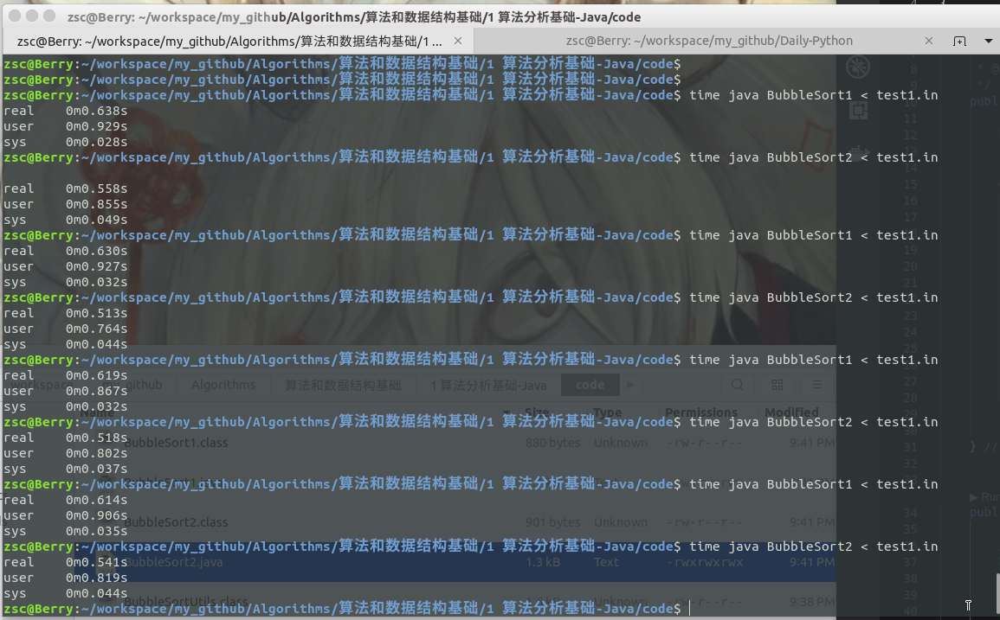
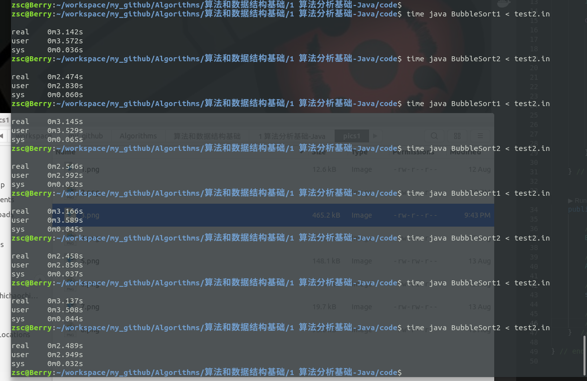
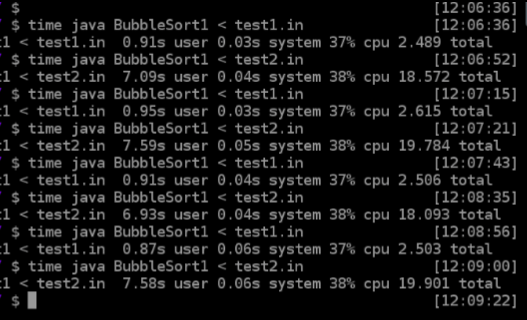
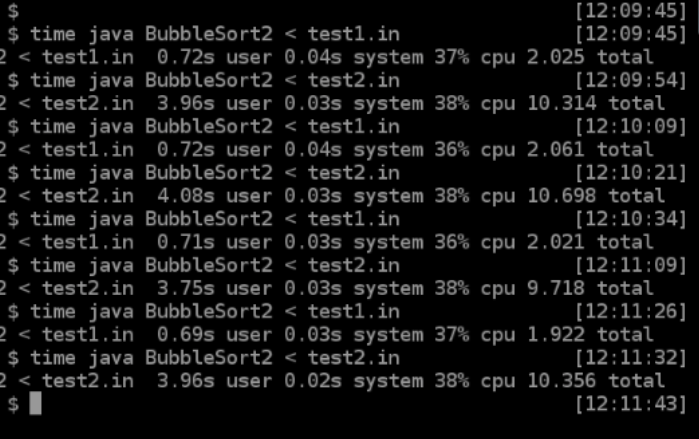

# 算法分析基础Java版
> 作者保留权利。

## 一、知识点
- 理解算法效率分析的重要性
- 度量算法效率的一般框架
- 分析非递归算法效率
- 分析递归算法效率
- 经验分析法（实验法）
- 模拟测试数据生成

## 二、实验原理
## 2.1 算法效率分析的一般框架

算法效率主要有2种——时间效率（时间复杂度）和空间效率（空间复杂度）。由于计算机存储容量越来越大，现在，空间复杂度往往不是最值得关注的。本实验主要关注**时间复杂度**。

### 2.1.1 如何度量输入规模？

首先需要明确，输入规模在算法效率分析过程中，是一个很重要的问题。因为，显然，在算法相同、计算机硬件相同的条件下，算法输入规模越大，运行时间越长（比如，数组越大，对数组排序需要的时间越长）。因此，算法效率和输入规模$n$紧密关联。

那么，如何确定这个**输入规模$n$**呢？

在大多数情况下，这是显而易见的。例如，对于排序、查找等列表相关的算法，输入规模$n$就是列表的长度。

不过，有时候，还是要根据算法细节，具体问题具体分析。比如，对于大数计算的问题，因为计算机存储是二进制形式的，所以可以用二进制的比特位数，来表示输入规模。

### 2.1.2 如何度量运行时间？

这里专注分析时间复杂度。

所以，接下来，需要确定算法程序运行时间的度量单位。

日常生活中，我们用时、分、秒来度量时间。但是，由于不同的计算机硬件运算速度千差万别，用标准的时间单位来计量运行时间是不合理的。

写过程序的同学都知道，大多数编程语言属于命令式编程（即逐条指令执行；另一种模式是符号式编程，有兴趣的同学可以自己去了解）。对命令式编程而言，每一条指令都需要执行时间，所以，我们可以找到算法中**频繁发生的操作**，比如，对于排序算法，比较大小操作是在while（或者for）循环中频繁发生的操作，我们把这种操作称作：**基本操作**。

所以，令$C_{op}$表示**基本操作的执行一次的时间**，用$C(n)$表示基本**操作执行的次数**，那么，算法运行时间可以表示为：

$$T(n)=C_{op}\times C(n)$$

当然，由于忽略了次要操作，这只是一个近似的结果。但是，对一般的算法效率分析来说，这个结果已经足够好了。一般假定$C_{op}$是**常数**，可以忽略。

多说一点，对于输入规模很大的程序，需要特别强调运算次数。比如，对同一个输入规模为$n$的问题，有7个算法可以解决。7个算法分别需要运行的次数是：$log_2 n,n,nlog_2 n,n^2,n^3,2^n,n!$，当$n=10和n=100$的时候：

| $log_2n$ | $n$    | $nlog_2n$       | $n^2$ | $n^3$ | $2^n$              | $n!$                |
| :------: | :----: | :--------------: | :----: | :----: | :-----------------: | :------------------: |
|3.3|10|$3.3\times 10^1$|$10^2$|$10^3$|$1.024\times 10^3$|$3.6\times 10^6$|
| 6.6      | $10^2$ | $6.6\times 10^2$ | $10^4$ | $10^6$ | $1.3\times 10^{30}$ | $9.3\times 10^{157}$ |

可以看出，算法设计的好坏，会大幅影响算法效率。输入规模小的时候可能不明显，但是，一旦输入规模足够大，那些设计的差的算法很可能白白浪费大量的时间，也没办法得到结果。

### 2.1.3 最优效率、最差效率和平均效率

以“**查找某一数字是否在数组中**”为例，伪代码如下：

```c++
Search(A, K)
//数组A和要查找的数字K
i = 0
while i < len(A) and A[i] not K do 
    i = i + 1
if i < n return i else return -1
```

**最差效率**（Worst case efficiency）是：输入规模为$n$，算法在最坏情况下的效率。以上面的查找算法为例，最差的情况是，直到遍历到数组的最后一个元素才找到，或者数组里根本没有要查找的元素，即$C_{worst}=n$。

**最优效率**（Best case efficiency）是：输入规模为$n$，算法在最好情况下的效率。以上面的查找算法为例，最好的情况是，数组的第一个元素就是要查找的元素，即$C_{best}=1$。

**平均效率**（Average case efficiency）是：在随机输入的情况下，算法的效率。平均效率分析比较困难，我们会在需要的时候单独分析。不过你需要明确，**平均效率并`不是`最差效率和最优效率的平均值**。

### 2.1.4 算法分析框架小结

- 确定输入规模$n$；
- 确定运行时间（次数）$C(n)$；
- 分别分析最差效率、最优效率和平均效率；

### 2.1.5 渐近符号表示


- O

算法效率$T(n)$包含在$O(g(n))$中，记作$T(n)\in O(g(n))$，表示存在大于0的常数c和非负整数$n_0$，使得，对所有$n\geq n_0$，有$T(n)\leq cg(n)$。简单来说，$O(g(n))$限制了$T(n)$的上界。

参考上图，大O的表示。T表示真，F表示假。

- $\Omega$

算法效率$T(n)$包含在$\Omega(g(n))$中，记作$T(n)\in \Omega(g(n))$，表示存在大于0的常数c和非负整数$n_0$，使得，对所有$n\geq n_0$，有$T(n)\geq cg(n)$。简单来说，$\Omega(g(n))$限制了$T(n)$的下界。

参考上图，$\Omega$的表示。T表示真，F表示假。

- $\Theta$

算法效率$T(n)$包含在$\Theta(g(n))$中，记作$T(n)\in \Theta(g(n))$，表示存在大于0的常数$c_1, c_2$和非负整数$n_0$，使得，对所有$n\geq n_0$，$c_1g(n)\leq T(n)\leq c_2g(n)$。简单来说，$\Theta(g(n))$同时限制了$T(n)$的上界和下界。

> 需要注意的是：
>
> - $O$不是最差效率
> - $\Omega$不是最优效率
> - $\Theta$也不是平均效率
>
> 一般情况下，$O$表示法最常用。

### 2.1.6 基本渐近类型

使用$O$符号表示算法效率的时候，我们一般找到最简的、最小的那个上界。比如对于数组查找而言，可以轻易得出，查找次数不会大于数组长度n，那么$g(n)=0.001n,n, n^2, 2n+1$等都可以满足$T(n)\in O(g(n))$的条件，但是我们一般选择$g(n)=n$，即$T(n)\in O(n)$，略去常数系数，略去低阶项，选择一个最简的形式。

这个$O(n)$就是我们后文说的，渐近类型。基本的渐进类型有:

- 常量  $O(1)$
- 对数  $O(logn)$
- 线性  $O(n)$
- 线性对数  $O(nlogn)$
- 平方  $O(n^2)$
- 立方  $O(n^3)$
- 指数  $O(2^n)$
- 阶乘  $O(n!)$

## 2.2 非递归算法分析举例

对于上文提到的，“查找某个元素是否在数组中”的问题：

```cpp
Search(A, K)
//数组A和要查找的数字K
i = 0
while i < len(A) and A[i] not K do 
    i = i + 1
if i < n return i else return -1
```

- 输入规模 n
- 基本操作：比较大小
- 基本操作次数：$C(n)=\sum_0^{n-1}1=n$
- 算法效率：$T(n)=C_{op}\times C(n)$，基本操作的时间$C_{op}$是常数，从而略掉。
- 所以 $T(n)\in O(n)$

## 2.3 递归算法分析举例

递归算法是计算机领域一个基础的算法。它包含如下特征：

- 递归程序会调用自身
- 递归程序必须有一个终止条件

比如，我们使用递归求阶乘，伪代码如下：

```cpp
F(n):
if n = 1 then 
	return 1
else
    returnn F(n-1)*n
end if    
```

- 输入规模：n
- 基本操作：乘法
- 递推关系和初始条件： $C(n)=C(n-1)+1,C(1)=1$
- $C(n)=C(n-1)+1=C(n-2)+1+1=...=C(1)+n-1=n$
- 所以，$T(n)=C_{op}\times n\in O(n)$

## 2.4 经验分析

上面的理论分析不依赖算法的语言、计算机硬件等外部因素，通过对基本操作计数进行算法效率分析，忽略了算法效率的常数项、低阶项，使用渐进符号（$O, \Omega,\Theta$等）表示算法效率（算法复杂度）。但是在实际应用的时候，我们需要考虑这些常数项等的影响。

> In theory, theory and practice are the same. In practice, they are not. 

经验分析，主要通过实验，来得到算法效率。最直接的方法就是在**相同的计算机硬件**上，对算法运行时间计时。关于计时的方法，会在实验部分说明。值得注意的问题是，对`算法`运行时间准确计时是很困难的，所以我们只能得到一个尽可能准确的时间。

同时，经验分析，也可以通过实验比较不同算法的效率，你将在实验部分见到这种应用。

## 三、实验步骤
在实验原理部分，我们讲解了算法效率的理论分析（渐近符号表示法），并简单介绍了经验分析方法。本小结主要介绍经验分析法，用程序的运行时间，来度量算法效率。

实验主要用两种方法计算程序运行时间：

- linux的time指令
- nanotime()方法调用

本小结会涉及到一些算法的Java实现，但是由于本次实验主要目的是，分析算法效率，所以你可以不去纠结算法的细节。所有代码已经写好，无需抄写代码。

## 3.1 冒泡排序算法效率 

给出2种冒泡排序的实现：BubbleSort1.java和BubbleSort2.java。并给出两个数据集：test1.in和test2.in。我们需要测试这两个程序的运行时间。

首先编写排序算法需要的一些辅助函数。这些函数在文件`BubbleSortUtils.java`里面，主要包括两个函数：

- getInput()：读入数据
- print()：打印排序后的数组

```java
//BubbleSortUtils.java
import java.util.*;

public class BubbleSortUtils
{
	
    /**
     * 读取测试数据
     * @返回一个数组
     */
    public static ArrayList<Integer> getInput() {
        Scanner in = new Scanner(System.in);
        
        ArrayList<Integer> array = new ArrayList<Integer>();
        
        while (in.hasNextInt()) {
            array.add(new Integer(in.nextInt()));
        }
        
        return array;
    }     
    
    /**
     * 打印排序后的数组
     */
    public static void print(ArrayList<Integer> array) {
        Iterator ait = array.iterator();
        
        while (ait.hasNext()) {
            System.out.print(ait.next() + " ");
        }
        System.out.println();
    } 
} 
```

接下来看看冒泡排序算法的第一个实现方法`BubbleSort1.java`：

> 由于在sort函数中，if块中的内容不是每次都执行，而2个for循环里面，i，j和数组大小的比较每次都执行，所以用`比较操作`作为基础操作；以数组大小n作为输入规模，则算法效率理论上$T(n)\in O(n^2)$。

```java
//BubbleSort1.java
import java.util.ArrayList;

public class BubbleSort1
{
    /**
     * 对输入数组排序
     */
    public void sort(ArrayList<Integer> array) {
        
        for (int i = 0; i < array.size(); i++) {
            for (int j = 0; j < array.size() - 1; j++) {
                // 检查是否需要交换
                if (array.get(j) > array.get(j+1)) {
                    Integer temp = array.get(j);
                    array.set(j, array.get(j+1));
                    array.set(j+1, temp);
                }
            }
        }
    } 
    
    // main函数
    public static void main(String[] args) {
        // 构建一个新的排序对象
        BubbleSort1 sorter = new BubbleSort1();        
        // 读入数据
        ArrayList<Integer> array = BubbleSortUtils.getInput();         
        // 排序
        sorter.sort(array);        
        // 打印排序后的数组（可选）
        //BubbleSortUtils.print(array);   
    }    
} 

```

接下来看看冒泡排序算法的另一个实现方法`BubbleSort2.java`：

> 由于在sort函数中，if块中的内容不是每次都执行，而for循环里面，i和remainingLen的比较每次都执行，在while循环中，每次都判断swap的真假，每次都给swap赋值，所以`比较操作、判断真假、赋值操作`为基础操作，我们可以近似认为这三种基础操作需要的时间（$C_{op}$）大致相同；以数组大小n作为输入规模，则算法效率理论上$T(n)\in O(n^2)$。
>
> 但是，由于remainingLen会逐渐变小，所以实际上BubbleSort2的实现方式比BubbleSort1可能快一些。后面会通过实验，直观展示这种差别。

```java
//BubbleSort2.java
import java.util.ArrayList;

public class BubbleSort2
{
    /**
     * 对输入数组排序
     */
    public void sort(ArrayList<Integer> array) {
        
        boolean swapped = false;
        int remainingLen = array.size();
        
        do {
            swapped = false;
            for (int i = 0; i < remainingLen - 1; i++) {
                // 检查是否需要交换
                if (array.get(i) > array.get(i+1)) {
                    Integer temp = array.get(i);
                    array.set(i, array.get(i+1));
                    array.set(i+1, temp);
                    swapped = true;
                }      
            }            
            remainingLen--;            
        } while (swapped);        
    } 
    
    public static void main(String[] args) {       
        // 创建一个排序对象
        BubbleSort2 sorter = new BubbleSort2();        
        // 读入数据
        ArrayList<Integer> array = BubbleSortUtils.getInput();         
        // 排序
        sorter.sort(array);        
        // 打印排序之后的数组（可选）
        //BubbleSortUtils.print(array);   
    }     
} 
```

接下来，编译BubbleSort1.java和BubbleSort2.java：

```shell
javac BubbleSort1.java
javac BubbleSort2.java
```

编译完成后，会得到`.class`文件：


接下来，使用linux的`time`指令，记录程序运行时间。

`time`命令输出的信息分别显示了该命令所花费的real时间、user时间和sys时间。

- real时间是指挂钟时间，也就是命令开始执行到结束的时间。这个短时间包括其他进程所占用的时间片，和进程被阻塞时所花费的时间。
- user时间是指进程花费在用户模式中的CPU时间，这是唯一真正用于执行进程所花费的时间，其他进程和花费阻塞状态中的时间没有计算在内。
- sys时间是指花费在内核模式中的CPU时间，代表在内核中执系统调用所花费的时间，这也是真正由进程使用的CPU时间。

> 我们主要关注`user`时间。

执行下面两条指令：

```shell
time java BubbleSort1 < test1.in
time java BubbleSort2 < test1.in
```

为了得到一个有代表意义的统计结果，上述指令交替运行四次，得到如下结果：



可以发现，BubbleSort2总是比BubbleSort1运行快！

test1.in只有5900多个数据，数据量比较小；现在我们用test2.in数据测试两个算法。test2.in的数据量大概是test1.in的3倍，程序运行时间的差别将会更加明显：

```shell
time java BubbleSort1 < test2.in
time java BubbleSort2 < test2.in
```

为了得到一个有代表意义的统计结果，上述指令交替运行四次，得到如下结果：



这次可以明显看出2种实现之间的效率差别。

接下来，我们验证算法复杂度是不是$O(n^2)$？

由于test2.in的数据规模是test1.in的3倍左右，`所以同样的实现，对test2.in数据排序所需要的时间，应该是对test1.in排序的9倍左右`（因为$\frac{(3n)^2}{n^2}=9$）。

先验证BubbleSort1：

```shell
time java BubbleSort1 < test1.in
time java BubbleSort1 < test2.in
```

为了得到一个有代表意义的统计结果，上述指令交替运行四次，得到如下结果：



我们发现，对test2.in的排序时间（`user时间`）确实大概是test1.in的8-9倍左右！

再验证BubbleSort2：

```shell
time java BubbleSort2 < test1.in
time java BubbleSort2 < test2.in
```

为了得到一个有代表意义的统计结果，上述指令交替运行四次，得到如下结果：



我们发现，对test2.in的排序时间（`user时间`）大概是test1.in的5-6倍左右！为什么这次差这么多呢？不要着急，这并不是因为我们的理论分析错了，具体原因学完了下一小节你就知道了！

## 3.2 如何更加准确地计时？

`time`指令虽然很简单，但是它也有很多缺点：

- 它记录`整个程序的运行时间，而不是算法运行时间`。具体来说，`time`指令除了记录算法运行时间，还记录了程序启动时间、内存分配时间、数据读写时间等；
- user时间单位是秒，对很多算法这不够精确。

为了更加准确地得到算法运行时间，推荐使用`System.nanoTime()`函数，可以精确到十亿分之一秒（nanoseconds）。

以`CountPrimes.java`文件为例说明`System.nanoTime()`函数的用法：**注意main函数中29-31行！**

```java
//CountPrimes.java
public class CountPrimes 
{
    public static int countPrimes(int n) {
        int count = 0;
        
        for (int i = n; i > 1; i--) {
            boolean np = false;
            for (int j = 2; j < i; j++) {
                // 测试是否为质数
                if (i % j == 0) {
                    np = true;
                    break;
                }
                
                // 质数个数加1
                if (!np) {
                    count++;
                }
            }
        }
        
        return count;
    } 
    
    public static void main(String[] args) {
        int n = 40000;
        
        long startTime = System.nanoTime();
        CountPrimes.countPrimes(n);
        long endTime = System.nanoTime();
        
        System.out.println("time taken = " + ((double)(endTime - startTime)) / Math.pow(10, 9) + " sec");
    } 
} 


```

编译并运行程序：

```shell
javac CountPrimes.java
java CountPrimes
```

得到结果，可以看到小数点后面有很多位小数，十分精确。

## 3.3 测试数据从哪里来？

算法的实际效率和算法输入的数据规模有直接关系。就好比之前提到的，对于`“查找数组里是否存在某个数字”`这个问题，假设数组很大，如果这个数字在数组的第一个的话，程序马上就能找到；但是，如果这个数字在数组最后一个，或者数组里没有这个数字，那么程序需要遍历整个数组，在数组很大的情况下，会很耗时！

所以，我们需要合理的测试数据来测试程序的效果。很多情况下，我们无法得到真实的数据，所以生成合理的模拟测试数据很重要。

那么，怎么得到合适的模拟测试数据呢？这里介绍一种随机生成的方法。Java语言里有很多随机数函数，你可以选择合适的函数生成你想要的测试数据。

文件`DataGenerator.java`展示了一个生成随机整数例子：

```java
//DataGenerator.java

import java.io.*;
import java.util.Random;

public class DataGenerator
{
	protected static final String progName = "DataGenerator";
	protected int mStartOfRange;
	protected int mEndOfRange;
	Random mRandGen;    
	/**
	 * 构造函数
	 * 
	 * @param startOfRange 随机数下界.
	 * @param endOfRange 随机数上界.
	 * @throws IllegalArgumentException 异常
	 */
	public DataGenerator(int startOfRange, int endOfRange) throws IllegalArgumentException {
		if (startOfRange < 0 || endOfRange < 0 || startOfRange > endOfRange) {
			throw new IllegalArgumentException("startOfRange or endOfRange is invalid.");
		}
		mStartOfRange = startOfRange;
		mEndOfRange = endOfRange;
		// 使用当前时间作为随机种子
		mRandGen = new Random(System.currentTimeMillis());
	} 
	
	public int sampleWithReplacement() {
		Random r = new Random();
		return this.mStartOfRange+r.nextInt(this.mEndOfRange-this.mStartOfRange);
	} 
	/**
	 * 生成规定个数的随机数（可以有重复）
	 */
	public int[] sampleWithReplacement(int sampleSize) {
		int[] samples = new int[sampleSize];
		
		for (int i = 0; i < sampleSize; i++) {
			samples[i] = sampleWithReplacement();
		}		
		return samples;
	} 
	
	/**
	 * 生成规定个数的随机数（无重复）
	 * @param sampleSize 需要生成的随机数个数
	 * @throws IllegalArgumentException 当sampleSize比指定的范围还要大的时候，抛出异常。因为这个时候不可能生成那么多不重复的随机数。
	 */
	public int[] sampleWithOutReplacement(int sampleSize) throws IllegalArgumentException {
	    int populationSize = mEndOfRange - mStartOfRange + 1;
	    
	    if (sampleSize > populationSize) {
	    	throw new IllegalArgumentException("SampleSize cannot be greater than populationSize for sampling without replacement.");
	    }
	    
	    int[] samples = new int[sampleSize];
	    // fill it with initial values in the range
	    for (int i = 0; i < sampleSize; i++) {
	    	samples[i] = i + mStartOfRange;
	    }	    
	    // replace
	    for (int j = sampleSize; j < populationSize; j++) {
	    	int t = mRandGen.nextInt(j+1);
	    	if (t < sampleSize) {
	    		samples[t] = j + mStartOfRange;
	    	}
	    }
	   return samples;
	}
	/**
	 * 错误提示.
	 */
	public static void usage() {
		System.err.println(progName + ": <start of range to sample from> <end of range to sample from> <number of values to sample> <type of sampling>");
		System.exit(1);
	} 
	
	public static void main(String[] args) {		
		// 检测是否为程序提供了足够的参数
		if (args.length != 4) {
			usage();
		}
	
		try {
			// 得到随机数范围
			int startOfRange = Integer.parseInt(args[0]);
			int endOfRange = Integer.parseInt(args[1]);
			// 需要生成的随机数个数
			int sampleSize = Integer.parseInt(args[2]);
			// 采样方式
			String samplingType = args[3];
			// 随机数生成器
			DataGenerator gen = new DataGenerator(startOfRange, endOfRange);
			
			int[] samples = null;
			switch (samplingType) {
				// 选择对应的方式生成随机数
				case "with":
					samples = gen.sampleWithReplacement(sampleSize);
					break;
				case "without":
					samples = gen.sampleWithOutReplacement(sampleSize);
					break;
				default:
					System.err.println(samplingType + " is an unknown sampling type.");
					usage();
			}			
			// 打印生成的的随机数
			if (samples != null) {
				for (int i = 0; i < samples.length; i++) {
					System.out.print(samples[i] + " ");
				}
				System.out.println("");
			}			
		}
		catch (Exception e) {
			System.err.println(e.getMessage());
			usage();
		}		
	} 
} 
```

按照如下指令，编译并执行程序（`最后的4个参数分别表示：随机数下界、随机数上界、需要生成的随机数个数、是（with）否（without）而已有重复数字`）：

```shell
javac DataGenerator.java
java DataGenerator 10 30 10 with
java DataGenerator 10 30 10 without
java DataGenerator 5 12 10 with
java DataGenerator 5 12 10 without
```


## 四、实验总结

本实验是“算法设计与分析”系列教程的第一篇，通过介绍一个研究算法效率的通用框架，帮助学生学会对非递归算法和递归算法的效率进行理论分析，同时，了解理论分析和经验分析的异同。最后，通过几个Java代码实例，理论结合实际，体会算法效率分析的一般流程和算法效率的重要性。

## 五、课后习题
使用`System.nanoTime()`方法，改写BubbleSort2.java文件。

执行程序，得到分别输入test1.in和test2.in数据集时，BubbleSort2.java的`算法运行时间`（前面我们使用`time`指令得到的是`程序运行时间`），看看这次对两组测试数据，运行时间是否是大概9倍的关系。现在你知道为什么`time`命令计时不准确了吗？
